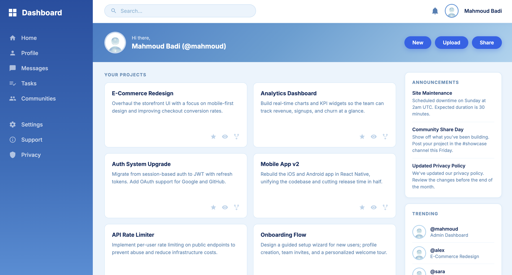

# Admin Dashboard

This project is part of [The Odin Project](https://www.theodinproject.com) curriculum, specifically the **Intermediate HTML and CSS** course.

## Live Demo

[View Live Demo](https://mahmoud-badi.github.io/Admin-Dashboard/)

## About

An admin dashboard built with HTML and CSS, focusing on CSS Grid for the overall layout. The dashboard includes a sidebar, header, project cards, announcements, and a trending section.

## Built With

- HTML5
- CSS3 (Grid, Flexbox)
- [Inter](https://fonts.google.com/specimen/Inter) - Google Fonts
- [Material Design Icons](https://pictogrammers.com/library/mdi/) - inline SVGs

